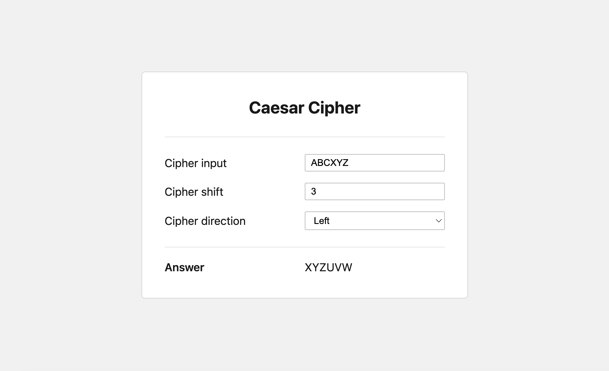

# Caesar Cipher

This app provides a minimal UI for creating [Caesar Ciphers](https://en.wikipedia.org/wiki/Caesar_cipher) with the option to set the shift amount and direction. It makes the assumption to currently not support characters with diacritic marks. The look and feel is intentionally fairly barebones and minimal at this stage.

Try the application on <a href="https://benjamin-white.github.io/caesar-cipher/" target="_blank">Github pages</a>.



## Quick Start

**To run the project on http://localhost:8080**

```sh
npm i && npm start
```

**To run the tests**

```sh
npm test
```
